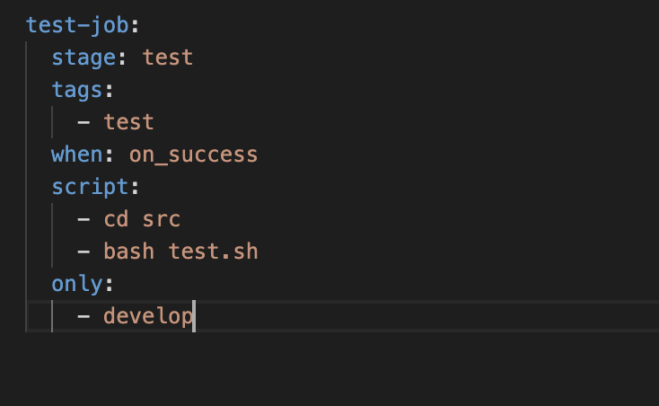
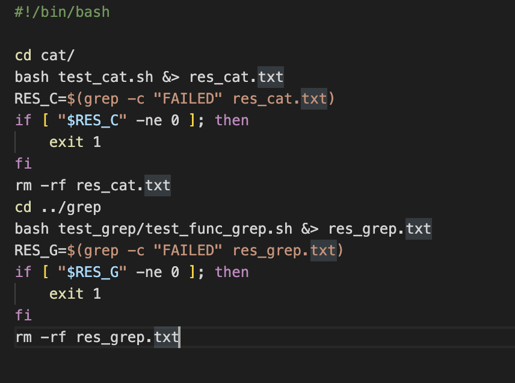

# Basic CI/CD

## Part 1. Настройка **gitlab-runner**

#### Подними виртуальную машину *Ubuntu Server 22.04 LTS*.

1. Поднял Ubuntu Server 22.04 LTS

#### Скачай и установи на виртуальную машину **gitlab-runner**.

2. Скачал и установил командами `curl -L "https://packages.gitlab.com/install/repositories/runner/gitlab-runner/script.deb.sh" | sudo bash` и `sudo apt-get install gitlab-runner`
   

#### Запусти **gitlab-runner** и зарегистрируй его для использования в текущем проекте (*DO6_CICD*).
- Для регистрации понадобятся URL и токен, которые можно получить на страничке задания на платформе.

3. Запустил и зарегестрировал командами `sudo gitlab-runner start` и `sudo gitlab-runner register`

## Part 2. Сборка

#### Напиши этап для **CI** по сборке приложений из проекта *C2_SimpleBashUtils*.
#### В файле _gitlab-ci.yml_ добавь этап запуска сборки через мейк файл из проекта _C2_.
#### Файлы, полученные после сборки (артефакты), сохрани в произвольную директорию со сроком хранения 30 дней.

## Part 3. Тест кодстайла

#### Напиши этап для **CI**, который запускает скрипт кодстайла (*clang-format*).

## Part 4. Интеграционные тесты

#### Напиши этап для **CI**, который запускает твои интеграционные тесты из того же проекта.

1. написал

#### Запусти этот этап автоматически только при условии, если сборка и тест кодстайла прошли успешно.

2. Добавил `when: on_success`

#### В пайплайне отобрази вывод, что интеграционные тесты успешно прошли / провалились.

## Part 5. Этап деплоя

`-` Для завершения этого задания ты должен перенести исполняемые файлы на другую виртуальную машину, которая будет играть роль продакшена.

**== Задание ==**

#### Подними вторую виртуальную машину *Ubuntu Server 22.04 LTS*.

1. Поднял и настроил

2. Далее создал на пользователя gitlab-runner на виртуальной машине. Создал ключ доступа, скопировал его и настроил доступ по ssh.

Для этого использовал команды:
sudo su gitlab-runner - переключился на пользователя
- ssh-keygen -t rsa -b 2048 - сгенерировал ключ
- ssh-copy-id hactarca@192.168.100.15 - скопировал на вторую виртуальную машину
- ssh hactarca@192.168.100.15 - подключился удаленно ко второй машине

Далее на виртуальной машине cd@192.168.100.15 так же сгенерировал ключ и настроил доступ.
- ssh-keygen -t rsa -b 2048
- ssh-copy-id hactarca@192.168.100.14
- sudo chown -R $(whoami) /usr/local/bin

> sudo chown -R $(whoami) /usr/local/bin изменяет владельца и группу для всех файлов и каталогов в директории /usr/local/bin на текущего пользователя, который исполняет эту команду. (chown - change owner)

#### Напиши этап для **CD**, который «разворачивает» проект на другой виртуальной машине.
#### Запусти этот этап вручную при условии, что все предыдущие этапы прошли успешно.

2. Написал этап деплоя. Добавил условие запуска вручную `when: manual`

#### Напиши bash-скрипт, который при помощи **ssh** и **scp** копирует файлы, полученные после сборки (артефакты), в директорию */usr/local/bin* второй виртуальной машины.

3. Написал скрипт

#### В файле _gitlab-ci.yml_ добавь этап запуска написанного скрипта.

4. Добавил

В результате ты должен получить готовые к работе приложения из проекта *C2_SimpleBashUtils* (s21_cat и s21_grep) на второй виртуальной машине.

## Part 6. Дополнительно. Уведомления

**== Задание ==**

##### Настрой уведомления о успешном/неуспешном выполнении пайплайна через бота с именем «[твой nickname] DO6 CI/CD» в *Telegram*.

1. Создал своего бота через BotFather в ТГ и использовал предоставленный токен. Кроме того, узнал свой ID через getmyid_bot в ТГ. Далее написал скрипт и настроил уведомления.

> URL="https://api.telegram.org/bot$TG_BOT_TOKEN/sendMessage": формируется URL для отправки сообщения с помощью Telegram Bot API. $TG_BOT_TOKEN - это переменная среды, содержащая токен вашего Telegram бота.

> TEXT="$CI_JOB_NAME %0AStatus: $CI_JOB_STATUS$1%0A%0AProject:+$CI_PROJECT_NAME%0AURL:+$CI_PROJECT_URL/pipelines/$CI_PIPELINE_ID/%0ABranch:+$CI_COMMIT_REF_SLUG": формируется текст сообщения, которое будет отправлено. Здесь используются переменные среды GitLab CI/CD:
   - $CI_JOB_NAME - имя текущей работы (job)
   - $CI_JOB_STATUS - статус текущей работы (success, failed, canceled и т.д.)
   - $1 - дополнительный текст, который может быть передан в скрипт как аргумент
   - $CI_PROJECT_NAME - имя проекта
   - $CI_PROJECT_URL - URL проекта
   - $CI_PIPELINE_ID - ID текущего конвейера (pipeline)
   - $CI_COMMIT_REF_SLUG - имя ветки или тега

   Символы %0A представляют перевод строки в URL-кодировке.

> curl -s --max-time $TIME -d "chat_id=$TG_USER_ID&disable_web_page_preview=1&text=$TEXT" $URL > /dev/null: отправляется POST-запрос на URL Telegram Bot API с помощью утилиты curl. Здесь:
   - -s - скрывает вывод curl в консоль
   - --max-time $TIME - устанавливает максимальное время ожидания ответа в секундах (переменная $TIME)
   - -d - передает данные запроса в формате name=value
   - chat_id=$TG_USER_ID - ID чата (личного или группового), куда будет отправлено сообщение (переменная $TG_USER_ID)
   - disable_web_page_preview=1 - отключает предпросмотр веб-страниц в Telegram (если есть ссылки в сообщении)
   - text=$TEXT - текст сообщения (подготовленный ранее)
   - /> /dev/null - перенаправляет вывод curl в специальное устройство /dev/null, чтобы скрыть его в консоли

Этот скрипт предназначен для использования в пайплайне GitLab CI/CD и позволяет отправлять уведомления в Telegram о статусе работ, таких как успешное или неудачное выполнение, а также дополнительную информацию о проекте, конвейере и ветке.